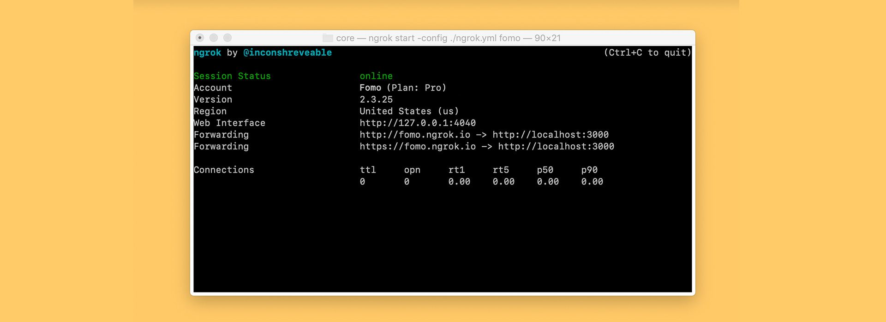

# Ngrok Installer for Linux

This project provides a simple script to install **Ngrok** on Linux-based systems (e.g., Ubuntu). The script ensures compatibility with multiple architectures and automates the entire installation process.



## Features
- Automatically detects your system architecture.
- Downloads the appropriate version of **Ngrok**.
- Configures **Ngrok** to run from any directory using `$PATH`.
- Supports installation on Ubuntu and Debian-based distributions.

## Prerequisites
Make sure your system has the following:
- A Linux-based OS (Ubuntu, Debian, or compatible).
- `wget` and `proot` installed (the script installs them if missing).
- Basic user permissions to run shell scripts.

## Installation

1. Clone the repository or copy the script files:
   ```bash
   git clone https://github.com/nuntius-dev/ngrok
   cd ngrok
   ```

2. Make the `install.sh` script executable:
   ```bash
   chmod +x install.sh
   ```

3. Run the installation script:
   ```bash
   bash install.sh
   ```

4. After installation, ensure the `~/.local/bin` directory is added to your `PATH`:
   ```bash
   source ~/.bashrc
   ```

5. Verify the installation:
   ```bash
   ngrok version
   ```

## Usage
After installation, you can run **Ngrok** using the `ngrok` command:
```bash
ngrok <options>
```

Example:
```bash
ngrok http 8080
```

## Files in the Project

### `install.sh`
The main installation script that:
- Sets up directories for Ngrok.
- Updates and installs required dependencies.
- Configures the system to include Ngrok in the `PATH`.

### `get-ngrok.sh`
A helper script that:
- Detects the system architecture.
- Downloads the appropriate **Ngrok** binary.
- Extracts and cleans up after downloading.

### `ngrok`
A wrapper script to run Ngrok directly from `$HOME/.local/bin`.

## Uninstallation
To completely remove Ngrok and its associated files, run:
```bash
rm -f ~/.local/bin/ngrok
rm -rf ~/.local/share/ngrok
```

## Troubleshooting
- **Permission Denied:** Ensure the Ngrok binary has executable permissions:
  ```bash
  chmod +x ~/.local/bin/ngrok
  ```
- **Command Not Found:** Add `~/.local/bin` to your `PATH`:
  ```bash
  export PATH="$HOME/.local/bin:$PATH"
  ```
